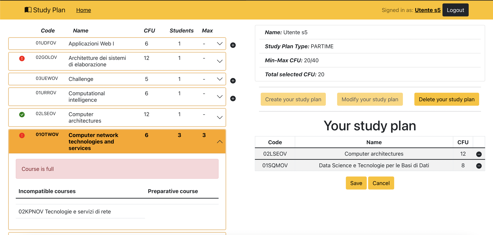

# Exam #1: Piano di studi 
## Student: s304045 CAGNAZZO CHRISTIAN DAMIANO 

## React Client Application Routes

- Route `/`: reindirizza sempre ad `/home`
- Route `/login`: contiene il form per effettuare il login
- Route `/home`: contiene la lista dei corsi e le loro informazioni, è raggiungibile anche da utenti non loggati
- Route `/logged-home`: contiene la lista dei corsi a sinistra e il piano di studi, se esiste, a destra; è raggiungibile solo da utenti non loggati
- Route `/logged-home/edit`: come logged-home, ma in più abilita i pulsanti per editare il piano di studi e mostra informazioni aggiuntive riguardo ai corsi che non possono essere aggiunti o che sono soggetti a vincoli 
- Route `/error`: si viene indirizzati in caso di errori gravi lato server (come per esempio database non raggiungibile) e mostra un messaggio di errore, ma non è raggiungibile se non ci sono realmente errori


## API Server

- POST `/api/sessions` 
  - Descrizione: Permette di autenticare l'utente per inizializzare una sessione
  - Request body: Oggetto contenente le credenziali dell'utente (Content-Type: application/json)
  
  ```
  {
    "username": "s100100@polito.it",
    "password": "1234"
  }
  ```

  - Response: `200 OK` 
  - Response body: Oggetto che rappresenta l'utente (Content-Type: application/json)
  ```
  {
    "id": 1,
    "username": "s1@polito.it",
    "name": "Utente s1"
  }
  ```
  - Error response: `503 Service Unavailable` (errore generico), `401 Unauthorized` (Username e/o password errati)

##

- GET `/api/sessions/current` 
  - Descrizione: Verifica se esiste una sessione autenticata
  - Request body: /
  - Response: `200 OK` 
  - Response body: Oggetto che rappresenta l'utente (Content-Type: application/json)
  ```
  {
    "id": 1,
    "username": "s1@polito.it",
    "name": "Utente s1"
  }
  ```
  - Error response: `503 Service Unavailable` (errore generico), `401 Unauthorized` (Utente non autenticato)


##


- GET `/api/sessions/current` 
  - Descrizione: Elimina la sessione corrente se esiste
  - Request body: /
  - Response: `200 OK` 
  - Response body: /
  - Error response: `503 Service Unavailable` (errore generico)


##


- GET `/api/courses` 
  - Descrizione: Restituisce la lista dei corsi con tutte le loro informazioni
  - Request body: /
  - Response: `200 OK` 
  - Response body: 
    ```
    [
      {
        "code": "05BIDOV",
        "name": "Ingegneria del software",
        "cfu": 6,
        "preparatory": {
          "code": "02GOLOV",
          "name": "Architetture dei sistemi di elaborazione"
        },
        "maxStudents": null,
        "incompatibles": [
          {
            "code": "04GSPOV",
            "name": "Software engineering",
            "cfu": 6
          }
          ],
          "students": 0,
          "full": false
      },
      ...
    ]
    ```
  - Error response: `500 Internal Server Error` (errore generico)

##

- GET `/api/studyPlan` 
  - Descrizione: Restituisce le informazioni del piano di studi (inclusi i corsi) dell'utente autenticato in sessione, se ne ha già creato uno
  - Request body: /
  - Response: `200 OK` 
  - Response body: 
  ```
  {
    "id": 5,
    "type": "PARTIME",
    "mincfu": 20,
    "maxcfu": 40,
    "courses": [
      {
        "code": "02GOLOV",
        "name": "Architetture dei sistemi di elaborazione",
        "cfu": 12
      },
      {
        "code": "03UEWOV",
        "name": "Challenge",
        "cfu": 5
      },
      {
        "code": "01URROV",
        "name": "Computational intelligence",
        "cfu": 6
      }
    ],
    "cfu": 23
  }
  ```
  - Error response: `500 Internal Server Error` (errore generico), `404 Not Found` (L'utente non ha uno study plan)


##

- DELETE `/api/studyPlan` 
  - Descrizione: Elimina il piano di studi, se esiste, dell'utente autenticato in sessione
  - Request body: /
  - Response: `204 No Content` 
  - Response body: /
  - Error response: `500 Internal Server Error` (errore generico)

##


- POST `/api/studyPlan` 
  - Descrizione: Sostituisce il vecchio study plan (se esisteva) dell'utente autenticato in sessione e ne crea uno nuovo, se i corsi inseriti non violano nessun vincolo
  - Request body: 
  ```
  {
    "type": "PARTIME",
    "courses": ["02GOLOV", "07GOLOS"]
  }
  ```
  - Response: `201 Created` 
  - Response body: /
  - Error response: `500 Internal Server Error` (errore generico), `422 Unprocessable Entity` (Uno o più corsi dello study plan non soddisfano dei vincoli)


## Database Tables

- Table `course` - serve a memorizzare le informazioni di ogni corso, quali codice, nome, cfu, il suo corso propedeutico, se ce l'ha, e il limite di studenti, se ce l'ha
- Table `incompatibleCourse` - contiene le coppie di corsi incompatibili
- Table `user` - contiene gli utenti e le loro informazioni quali id, email, nome, password e salt
- Table `studyPlan` - contiene le informazioni dei piani di studi, ovvero id, tipo, l'utente a cui appartiene e il minimo e massimo di crediti in base al tipo di piano di studi
- Table `coursesStudyPlan` - tabella nata dalla relazione molti a molti tra "course" e "studyPlan"; memorizza i corsi assegnati ad ogni piano di studi

## Main React Components

- `StudyPlanApp` (in `StudyPlanApp/StudyPlanApp.js`): componente principale, definisce le route dell'applicazione e quali componenti renderizzare
- `LoginForm` (in `StudyPlanApp/Layout/Login.js`): contiene il form per effettuare il login
- `LoggedHomeLayout` (in `StudyPlanApp/Layout/Home.js`): componente che costruisce l'homepage dell'utente loggato, visualizzando a sinistra i corsi, e a destra informazioni sull'utente oltre al piano di studi, se esistente. Inoltre, presenta dei bottoni per creare, modificare, salvare o cancellare il piano di studi. 
- `CourseList` (in `StudyPlanApp/Courses/CourseList.js`): contiene la lista dei corsi offerti rappresentati dalla componente Courses/CourseRow
- `CourseRow` (in `StudyPlanApp/Courses/CourseList.js`): rappresenta una riga che contiene un corso tra quelli offerti con tutte le sue informazioni, i messaggi di errore in caso di violazione dei vincoli e il bottone per aggiungerlo al piano di studi
- `StudyPlan` (in `StudyPlanApp/StudyPlan/StudyPlan.js`):  contiene la lista dei corsi aggiunti al piano di studi rappresentati dalla componente StudyPlan/CourseRow
- `CourseRow` (in `StudyPlanApp/StudyPlan/StudyPlan.js`): rappresenta una riga che contiene un corso aggiunto al piano di studi e il pulsante per rimuoverlo dal piano di studi
- `StudentInfo` (in `StudyPlanApp/StudyPlan/StudyPlan.js`): contiene informazioni sull'utente e sul piano di studi attuale, quali cfu e tipo

## Screenshot



## Users Credentials

- username: s1@polito.com, password: 1234, STUDY PLAN FULLTIME
- username: s2@polito.com, password: 1234, STUDY PLAN PARTIME
- username: s3@polito.com, password: 1234, STUDY PLAN PARTIME
- username: s4@polito.com, password: 1234, STUDY PLAN NON CREATO 
- username: s5@polito.com, password: 1234, STUDY PLAN NON CREATO
